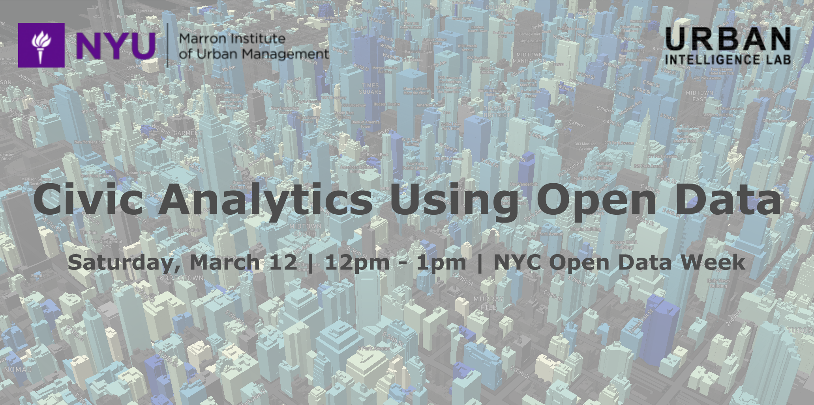

<!-- # Civic Analytics Using Open Data  -->
<!-- ### 2022 NYC Open Data Week - March 12, 2022 -->

**Speakers**
- Constantine E. Kontokosta
- Boyeong Hong
- Bartosz Bonczak

**Summary**

This workshop will inform and engage the audience in using NYC open data and civic analytics to address issues of social justice, public health, and climate action in NYC and other cities. We will show and explain how data-driven approaches can be applied to understand neighborhood change, support evidence-based policy and planning decisions, and empower residents through the democratization of data. Specific attention will be given to algorithmic fairness and the bias embedded in many existing datasets. Examples will include research and applied data projects using open data related to energy use and audits (LL84 and LL87), NYC311 reports, land use (PLUTO), mobility, and COVID-19.

Learn more about our work at https://www.urbanintelligencelab.org

Follow us on Twitter at [@UrbanIntelLab](https://twitter.com/urbanintellab) and [@NYUMarron](https://twitter.com/NYUMarron).
